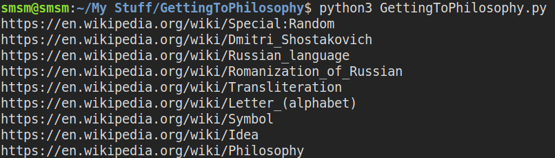
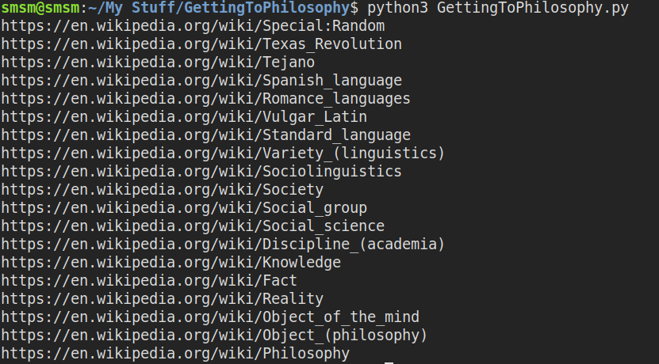
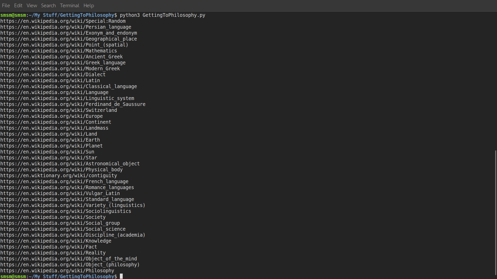
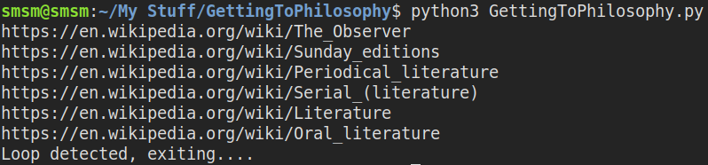

# GettingToPhilosophy
A Python script checks "Getting To Philosophy" Law: https://en.wikipedia.org/wiki/Wikipedia:Getting_to_Philosophy 

Clicking on the first link in the main text of a Wikipedia article, and then repeating the process for subsequent articles, would usually lead to the Philosophy article. 
The median link chain length to reach philosophy was 23.

### Examples:

97% of all articles in Wikipedia eventually led to the article Philosophy. The remaining articles lead to an article without any outgoing wikilinks or get stuck in loops. 

### Loop Example:

